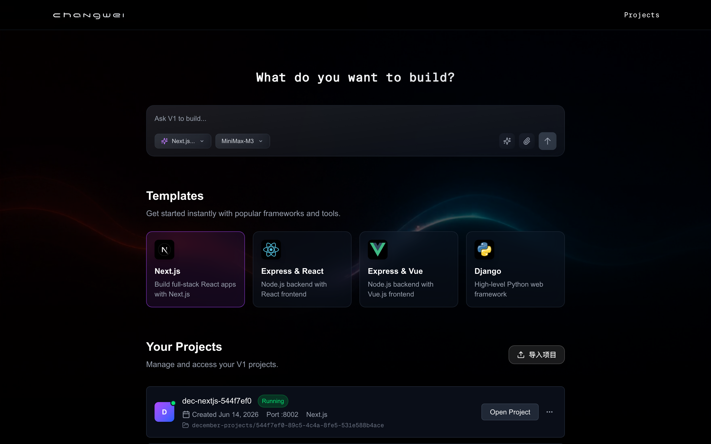
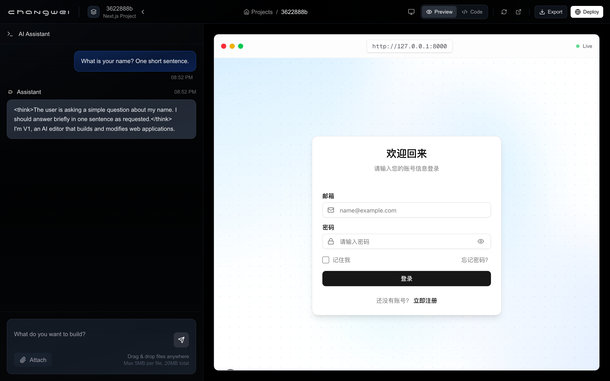

# V1

[English](README.md) | **简体中文**

> [v0.dev](https://v0.app) 的开源、自托管替代方案 — 用自然语言描述你想做的 Web 应用，看着它在实时预览中成形，再用聊天持续迭代。

## 截图

| 首页 — 项目列表与提示词          | 工作区 — AI 聊天 + 实时预览        |
|----------------------------------|--------------------------------------|
|      |      |

## V1 是什么？

V1 是一个跑在你本机上的 AI Web 应用生成器。用中文（或英文）描述你想要什么（"一个咖啡订阅服务的落地页，要有首屏大图、三档定价和 FAQ 区"），AI 代理会规划工作、把代码写进独立的项目容器，并在它还在写的时候给你一个可以交互的实时预览。

每个项目都跑在独立的 Docker 容器里，所以你可以并行开多个项目而互不干扰。你的代码、你的 API Key、你的数据，都完全由你掌控 —— 除非你主动部署，否则一切都不会离开你的机器。

**V1 和 v0 的关系，就像 [Ollama](https://ollama.com) 和 ChatGPT 的关系**：产品形态一样，只是模型由你自己带、跑在你自己的机器上。

## 功能特性

- **自然语言 → 可运行的应用** — 描述你想要什么，自动得到一个搭好脚手架并填好代码的 Next.js（App Router）项目。
- **iframe 实时预览** — AI 一边写文件，应用一边实时更新。热重载是内置的。
- **项目容器隔离** — 每个项目独占一个 Docker 容器和端口。启停、删除都不会影响其他项目。
- **通过聊天迭代** — AI 可以读、写、改名、删除文件；安装 npm 包；列出项目结构。全部在聊天面板里完成。
- **自带模型** — 支持任何 OpenAI 兼容端点（OpenAI、Anthropic、OpenRouter、本地 Ollama、MiniMax 等）。只需配置 `AI_BASE_URL` 和 `AI_API_KEY`。
- **内置设计规范** — 系统提示词自带无障碍、触控目标、性能、响应式布局等准则，生成的 UI 默认就是生产级质量。
- **支持 Markdown 的聊天** — 助手回复会正确渲染表格、代码块（默认折叠）、列表和行内代码。
- **导入 / 导出** — 支持从 GitHub 链接或 ZIP 文件导入项目；完成后可导出为 ZIP。
- **社区画廊** — 浏览并 fork 其他 V1 用户分享的项目。

## 快速上手

你需要 [Bun](https://bun.sh)（≥ 1.1）以及正在运行的 [Docker](https://docker.com)。用 Node 20+ 配 `npm`/`pnpm` 也可以。

### 1. 克隆并安装依赖

```bash
git clone https://github.com/wangchangwei/V1.git
cd V1

# 后端
cd backend && bun install && cd ..

# 前端
cd frontend && bun install && cd ..
```

### 2. 配置 AI 后端

V1 与任何 OpenAI 兼容的 API 对接。最常见的两种配置：

**OpenAI（默认）：**
```bash
cp backend/.env.example backend/.env  # 如果有 example 文件；否则直接创建
cat > backend/.env <<'EOF'
AI_API_KEY=sk-...
AI_BASE_URL=https://api.openai.com/v1
AI_MODEL=gpt-4o
AI_TEMPERATURE=0.7
EOF
```

**Anthropic 通过 OpenAI 兼容代理**（例如 LiteLLM，或者 `api.minimaxi.com`）：
```bash
cat > backend/.env <<'EOF'
AI_API_KEY=sk-ant-...
AI_BASE_URL=https://api.minimaxi.com/v1
AI_MODEL=MiniMax-M3
AI_TEMPERATURE=0.7
EOF
```

后端会自动在 `AI_BASE_URL` 末尾补 `/v1`（如果还没有的话），所以 `https://api.openai.com` 和 `https://api.openai.com/v1` 都能用。

### 3. 启动开发服务器

开两个终端，或者用附带的脚本：

```bash
./start.sh
```

或者分别启动：

```bash
# 终端 1 — 后端（端口 4002）
cd backend && bun run start

# 终端 2 — 前端（端口 3000）
cd frontend && bun run dev
```

然后打开 <http://localhost:3000>。

### 4. 开始造东西

点击 **"新建项目"**，输入类似这样的提示词：

> 一个 AI 笔记应用的 SaaS 落地页。深色主题，首屏带邮箱注册，三个特性卡片，一段两档定价，以及页脚。用 shadcn/ui 和 lucide-react。

看左侧聊天面板，AI 会规划工作、调用工具、写入文件；右侧预览实时更新。你可以用后续提问（"首屏再高一点"、"把 CTA 颜色换成翠绿色"）来持续迭代。

## 技术栈

| 层级            | 选型                                                    |
|-----------------|---------------------------------------------------------|
| 前端            | Next.js 15（App Router）、React 19、Tailwind CSS 4      |
| 代码编辑器      | Monaco                                                  |
| Markdown        | react-markdown + remark-gfm                             |
| 后端            | Express + Bun 运行时                                    |
| AI 集成         | 原生 OpenAI SDK v5（function-calling / tool use）       |
| 容器化          | Docker（每个项目一个容器）                              |
| 包管理          | Bun                                                     |

## 架构

```
V1/
├── frontend/                      Next.js 15 Web 应用
│   └── src/app/
│       ├── projects/              项目列表、卡片、工作区仪表盘
│       ├── create/                用于生成新应用的 AI 聊天界面
│       ├── editor/                浏览器内文件编辑器（Monaco）
│       └── community/             共享项目画廊
│
├── backend/                       Bun 上的 Express API
│   └── src/
│       ├── routes/
│       │   ├── chat.ts            POST/GET /chat/:id/messages（SSE 流式）
│       │   ├── containers.ts      项目生命周期、文件 CRUD、导入
│       │   └── models.ts          /models — 列出支持的模型
│       ├── services/
│       │   ├── llm.ts             OpenAI 工具调用循环 + SSE 流式
│       │   ├── tools.ts           工具定义（read/write/rename/delete/list/install）
│       │   ├── project.ts         容器启动、端口分配、恢复
│       │   ├── file.ts            容器内文件操作
│       │   ├── package.ts         bun add 包装
│       │   ├── import.ts          GitHub + ZIP 导入
│       │   └── export.ts          ZIP 导出
│       └── utils/prompt.txt       系统提示词（含设计规范）
│
├── template/                      vendored Next.js 项目模板（脚手架）
├── config.ts                      共享的 AI 配置（由后端读取）
├── start.sh                       开发启动脚本（两个服务并行）
└── data/                          运行时状态（容器元数据等）
```

每个项目都是从 `backend/template/`（vendored 的 Next.js 模板）实例化而来，跑在独立 Docker 容器的独立端口（8000+）上。后端往容器里写文件并在需要时代理请求。

## AI 循环的工作方式

1. 你发一条消息。
2. 后端把对话历史连同 [工具定义](backend/src/services/tools.ts) 一起发给 AI 模型。
3. 模型要么返回一段文字，要么返回一个或多个 `tool_calls`（`read_file`、`write_file`、`list_files` 等）。
4. 后端对项目的容器执行每个工具调用，把结果追加到消息里，再向模型请求下一轮。
5. 循环持续（最多 8 轮），直到模型返回纯文本回复且不再有 tool_call。
6. 通信走 SSE：你可以实时看到 `tool_call` / `tool_result` / `assistant` 事件一个个过来。

`backend/src/utils/prompt.txt` 里的系统提示词自带五类优先设计规范 —— 无障碍、触控目标、性能、风格选择、响应式布局 —— 生成的 UI 默认就遵循当前最佳实践，你不需要额外叮嘱。

## API 一览

完整接口在 [`backend/src/routes/`](backend/src/routes)，下面是主要端点：

| 方法   | 端点                              | 用途                          |
|--------|-----------------------------------|-------------------------------|
| GET    | `/containers`                     | 列出所有项目                  |
| POST   | `/containers/create`              | 新建项目                      |
| POST   | `/containers/:id/start` / `stop`  | 启停项目容器                  |
| DELETE | `/containers/:id`                 | 删除项目                      |
| GET    | `/containers/:id/files`           | 列出项目文件                  |
| GET    | `/containers/:id/file?path=…`     | 读文件                        |
| PUT    | `/containers/:id/files`           | 写文件                        |
| DELETE | `/containers/:id/files?path=…`    | 删除文件                      |
| POST   | `/containers/:id/dependencies`    | `bun add` 装包                |
| POST   | `/containers/import/github`       | 从 GitHub 导入                |
| POST   | `/containers/import/zip`          | 从 ZIP 导入                   |
| GET    | `/containers/:id/export`          | 下载项目 ZIP                  |
| POST   | `/chat/:id/messages`              | 发聊天消息                    |
| GET    | `/chat/:id/messages`              | 读聊天历史                    |
| GET    | `/models`                         | 列出你端点支持的模型          |

## 环境变量

全部配置在 `backend/.env`：

| 变量              | 默认值                       | 说明                                                  |
|-------------------|------------------------------|-------------------------------------------------------|
| `PORT`            | `4002`                       | 后端 API 端口                                         |
| `AI_API_KEY`      | —                            | 你的 AI 提供方 API Key（必填）                        |
| `AI_BASE_URL`     | `https://api.openai.com/v1`  | OpenAI 兼容端点 base URL（如果末尾没有 `/v1` 会自动补） |
| `AI_MODEL`        | `gpt-4o`                     | 传给提供方的模型标识                                  |
| `AI_TEMPERATURE`  | `0.7`                        | 采样温度（0–2）                                       |

## License

MIT。

## 致谢

V1 站在 [December](https://github.com/ntegrals/december) 的肩膀上 —— 这是一个同样开源的 AI Web 应用生成器。December 提供了核心架构：单项目 Docker 容器模型、文件系统即工具调用接口、聊天驱动的工作流，以及 Next.js 模板。V1 保留了这套基础，并加上了原生 OpenAI 工具调用重构、流式优先的聊天后端、支持 Markdown 的消息渲染器，以及内置设计规范的系统提示词。

感谢 December 团队的开源贡献。如果你在评估 V1 是否适合生产使用，也建议看看上游项目 —— 它是个值得一读的好项目，也是非常适合 fork 的基础。
